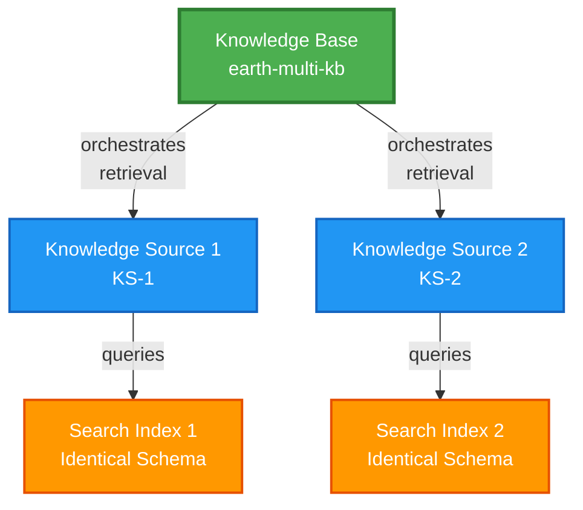

# Multi-Index Agentic Retrieval Demo

This demo showcases how to query and aggregate results across multiple Azure AI Search indexes using a single knowledge base with agentic retrieval.

## Overview

This Python notebook demonstrates:
- Creating two Azure AI Search indexes with identical schemas
- Splitting the NASA Earth at Night dataset across both indexes
- Configuring a single knowledge base with two knowledge sources
- Executing queries that aggregate results from both indexes simultaneously
- Displaying results with clear source attribution

## Architecture



## Prerequisites

1. **Azure Services**:
   - Azure AI Search service
   - AI Model deployment (one of the following):
     - **Azure OpenAI** service with embedding model (e.g., text-embedding-3-large) and chat model (e.g., gpt-4)
     - **Microsoft Foundry** project with embedded models deployed and connected to AI Search
   - Note: The notebook works seamlessly with models in either Azure OpenAI or Microsoft Foundry

2. **Python Environment**:
   - Python 3.8 or later
   - pip package manager

3. **Authentication & RBAC**:
   - Azure credentials configured (Azure CLI, Managed Identity, or Service Principal)
   - Run `az login` if using Azure CLI authentication
   - **Required Azure RBAC roles**:
     - Your user account: `Search Service Contributor` OR `Search Index Data Contributor` on the AI Search service
     - Your AI Search service (system-assigned managed identity): `Cognitive Services OpenAI User` on Azure OpenAI OR `Azure AI Developer` on Foundry project
   - Enable system-assigned managed identity on your Azure AI Search service

## Setup Instructions

### 1. Clone or download this repository

```bash
git clone <repository-url>
cd agentic-search-query
```

### 2. Create a virtual environment (recommended)

```bash
python -m venv venv

# On Windows:
venv\Scripts\activate

# On macOS/Linux:
source venv/bin/activate
```

### 3. Install dependencies

```bash
pip install -r requirements.txt
```

### 4. Configure environment variables

```bash
# Copy the sample environment file
cp .env.sample .env

# Edit .env with your Azure service endpoints and configuration
# Required values:
# - SEARCH_ENDPOINT: Your Azure AI Search service endpoint
# - AOAI_ENDPOINT: Your AI model endpoint (Azure OpenAI or Microsoft Foundry)
# - AOAI_EMBEDDING_MODEL and AOAI_EMBEDDING_DEPLOYMENT
# - AOAI_GPT_MODEL and AOAI_GPT_DEPLOYMENT
```

### 5. Run the notebook

Open `docs/multi-index-agentic-retrieval-demo.ipynb` in Jupyter Notebook or VS Code and run all cells sequentially.

## Notebook Structure

The notebook is organized into clear sections:

1. **Introduction** - Overview of multi-index agentic retrieval
2. **Environment Setup** - Load credentials and configure Azure clients
3. **Create Indexes** - Build two search indexes with identical schemas
4. **Load Data** - Split NASA dataset evenly across both indexes
5. **Create Knowledge Sources** - Configure one source per index
6. **Create Knowledge Base** - Set up single KB with both sources
7. **Execute Query** - Run multi-index query and retrieve results
8. **Display Results** - Show results with source attribution
9. **Cleanup** - Delete all created resources

## Key Features

### Multi-Source Query Aggregation
The knowledge base automatically:
- Decomposes queries into optimized subqueries
- Executes queries against both indexes concurrently
- Aggregates and ranks results from all sources
- Synthesizes natural language answers with citations

### Source Attribution
Results clearly show:
- Which index each result came from
- Distribution of results across indexes
- Side-by-side comparison view

### Resource Management
Complete cleanup section to:
- Delete the knowledge base
- Remove both knowledge sources
- Clean up both search indexes

## Dataset

The demo uses the **NASA Earth at Night** dataset from the [azure-search-sample-data](https://github.com/Azure-Samples/azure-search-sample-data) repository. The dataset contains information about Earth's nighttime light patterns, human activity, and natural phenomena visible from space.

## Cost Considerations

This demo creates Azure resources that may incur costs:
- Azure AI Search: Charged per hour based on pricing tier
- Azure OpenAI: Charged per token for embeddings and completions
- Storage: Minimal costs for document storage

**Important**: Always run the cleanup section when you're done to avoid unnecessary charges.

## Troubleshooting

### Authentication Errors
- Ensure you've run `az login` if using Azure CLI authentication
- Verify your credentials have appropriate permissions for Azure AI Search and Azure OpenAI
- Check that your service principal (if used) has the correct role assignments

### Index Creation Errors
- Verify your Azure AI Search service is running
- Check that your embedding model deployment exists in Azure OpenAI
- Ensure the model name and deployment name match in your .env file

### Query Errors
- Confirm both knowledge sources were created successfully
- Verify the knowledge base references both sources
- Check that both indexes have data loaded

### No Results from One Index
- The `always_query_source=True` parameter ensures both indexes are queried
- Check the activity log to verify queries were sent to both sources
- Verify data was split correctly between indexes

## Learn More

- [Azure AI Search Documentation](https://learn.microsoft.com/azure/search/)
- [Agentic Retrieval Overview](https://learn.microsoft.com/azure/search/search-agentic-retrieval)
- [Knowledge Base Concepts](https://learn.microsoft.com/azure/search/search-agentic-retrieval-how-to-index)

## License

This demo is provided as-is for educational purposes.

## Contributing

Contributions are welcome! Please feel free to submit issues or pull requests.
